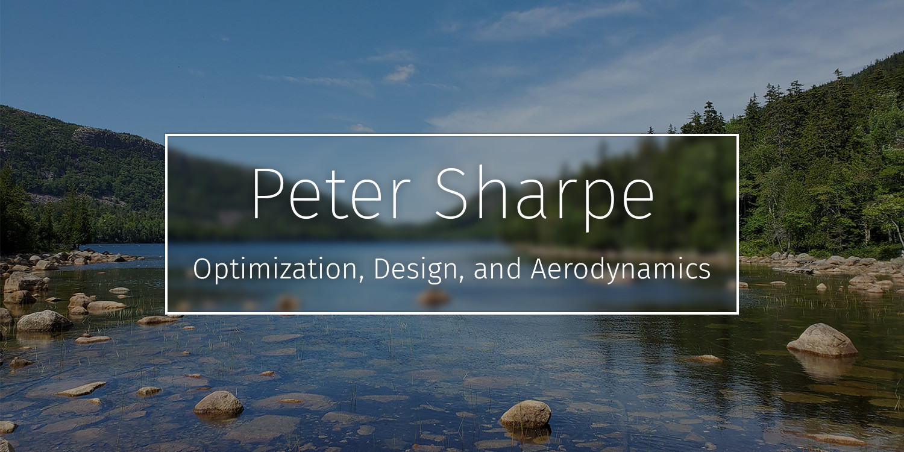

-----

Hello there! My name is Peter Sharpe, and I'm a graduate student at MIT AeroAstro studying aircraft design, multidisciplinary design optimization (MDO), and applied aerodynamics. 

At MIT, I research new optimization techniques that allow us to solve challenging real-world engineering problems.

Welcome to my GitHub! Come in. Have some tea. Stay a while.

-----

